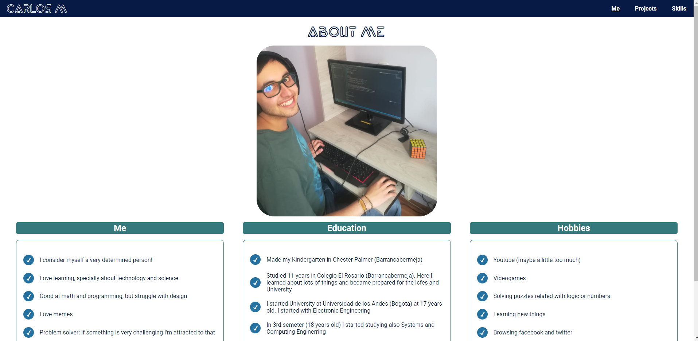

# Carlos Mario's (aka korkies22) Personal Web Page
After developing mainly with front end technologies for a long time, it was time to make my own personal web page. Fortunatelly, development web course from los Andes gave me the opportunity to test my skills with vanilla html, css and js.

## Running

This project was built using live server and watch sass from vsCode. So this is the recommended way for running it. But I think that any http-server package should be sufficient for running it. Regarding sass, all the compiled scss in the scss folder should go to the css folder, both of them found in the main project's folder
